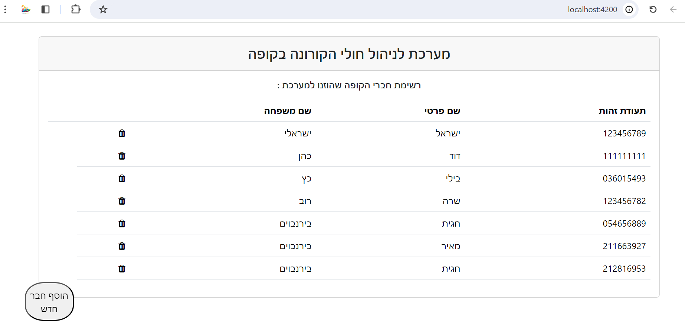
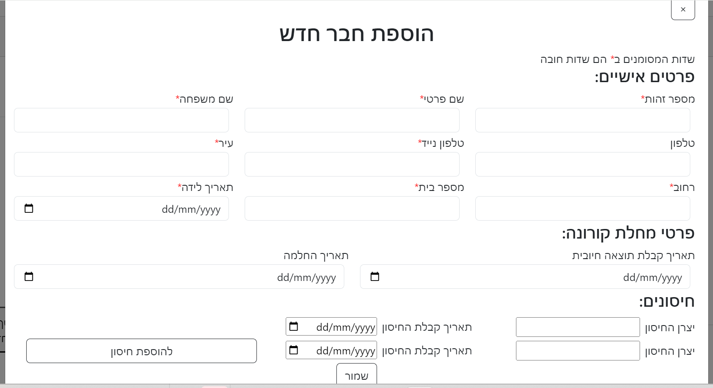
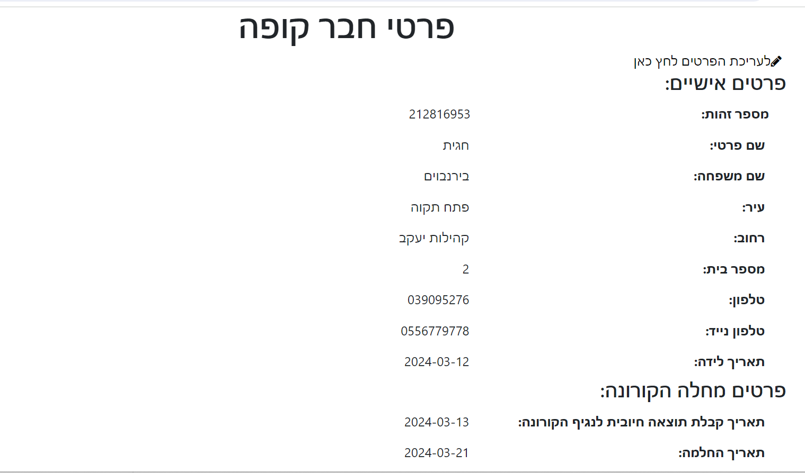
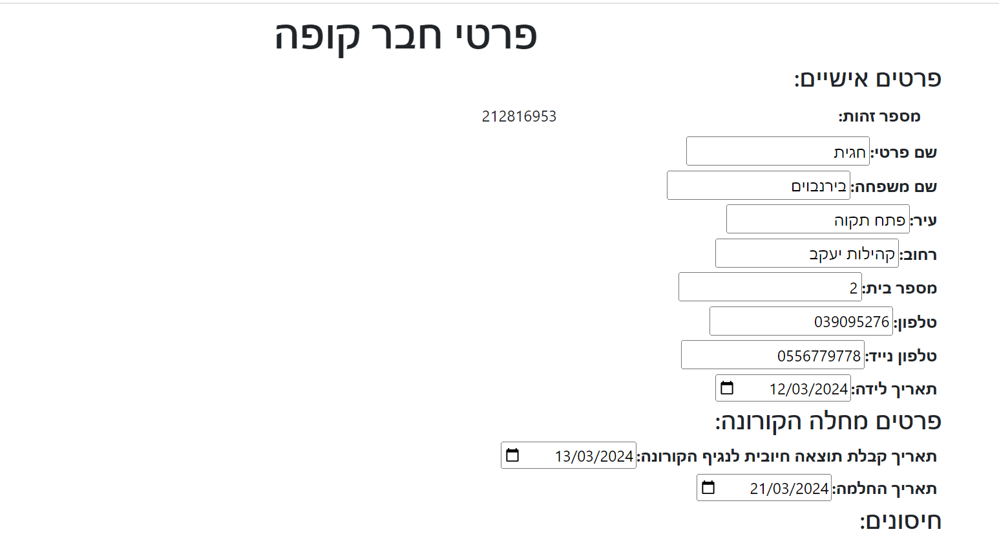
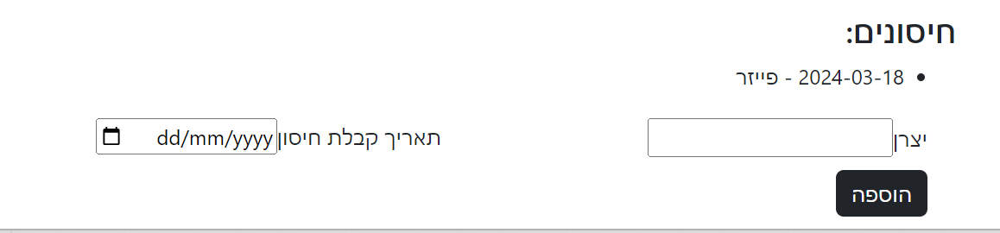

# Hadasim
# Corona Database Management

## Description
This project is aimed at managing the Corona database of a health insurance fund. It provides a platform to efficiently store, retrieve, and update information related to Corona cases, patient details, and more.

## Installation
To run this project locally, follow these steps:
1. Clone the repository: git clone https://github.com/chagitbirenboim/Hadasim/tree/main/        Ex_1_Chagit_Birenboim
2. Install Node.js dependencies for the server-side: npm install
3. Install Angular CLI globally: npm install -g @angular/cli
4. Install Angular dependencies for the client-side: cd client/angular && npm install

## Usage
To start the server, run node server.js in the root directory.
To start the client application, run npm start in the client directory.

Access the application at http://localhost:4200 in your web browser.

## Technologies Used
- Angular
- Node.js
- MongoDB
- Bootstrap

## Screenshots

## Contact
For any questions or feedback, feel free to contact us at [chagit2090@gmail.com](mailto:chagit2090@gmail.com).

